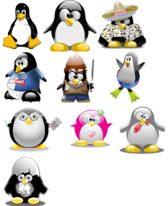

# Pack svg or png sprites

Create a pack of sprites from a directory of png/jpg/gif/svg images.

Images are packed at best to a square-ish png file, and their size and coordinates are exported to a json file.


```
NAME:
   spritizer - Create sprites from a directory of images

USAGE:
   spritizer [global options] command [command options] [arguments...]

COMMANDS:
   gen, g   Generate sprites
   help, h  Shows a list of commands or help for one command

GLOBAL OPTIONS:
   --debug     Set logging to debug (default: false)
   --quiet     Only log errors (default: false)
   --help, -h  show help (default: false)
```


```
NAME:
   spritizer gen - Generate sprites

USAGE:
   gen - generate sprites

OPTIONS:
   --inkscape              Use inkscape if available to process svg (default: false)
   --resize value          Resize to [resize] pixels width (default: 0)
   --name value, -n value  Output name (default: "sprite")
```

## Example

using example/input directory containing `tux[1-8].png` and `thetux[1-2].svg`

```bash
spritizer gen --resize 64 example/input example/output
```

generates the following png
 
 

and json file (by default, using mapbox sprites style)

```json
{
	"thetux": {
		"height": 75,
		"width": 64,
		"pixelRatio": 1,
		"x": 0,
		"y": 0
	},
	"tux1": {
		"height": 64,
		"width": 64,
		"pixelRatio": 1,
		"x": 64,
		"y": 0
	},
	"tux2": {
		"height": 64,
		"width": 64,
		"pixelRatio": 1,
		"x": 128,
		"y": 0
	}, ...
```

For svg files, https://github.com/srwiley/oksvg is used for rasterization.
But this rasterizer only implements a subset of the SVG2.0 specification => some svg files
cannot be rasterized or may contain some errors. If `inkscape` is available, it is used to 
rasterize the svg files not recognized by oksvg. You can choose to always use inkscape using 
the `--inkscape` flag.

`--resize WIDTH` argument force all images to be resized (upscaled or downscaled) to `WIDTH` 
pixels width.


## Docker

A docker container containing `inkscape` and `spritizer` is available.

```bash
docker run --rm -v ${pwd}:/data jmbarbier/spritizer gen --resize 100 --inkscape /data/input /data/output
``` 
 

 


